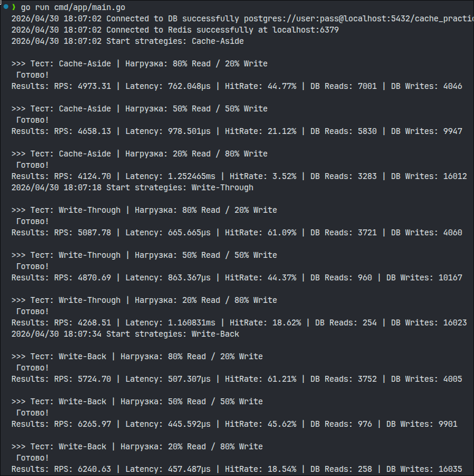

# Практика 3: сравнение типов кеширования

## Цель
Проверить три стратегии работы с кешем в идентичных условиях и сравнить их влияние на производительность приложения:
- **Cache-Aside** (Lazy Loading);
- **Write-Through**;
- **Write-Back**.

## Стенд
Тестирование проводилось внутри единого приложения на языке Go, включающего в себя логику генерации нагрузки и реализации стратегий:
- **Application/Load-gen:** Собственная реализация на Go с использованием `sync.WaitGroup` и каналов.
- **Cache:** Redis 7 (локальный запуск).
- **DB:** PostgreSQL 16 (локальный запуск).
- **Keyspace:** Ограниченный диапазон в 1000 ключей для создания условий высокой конкуренции.

## Стратегии

### 1. Cache-Aside (Lazy Loading)
- **Чтение:** Сначала проверяется Redis. При промахе — чтение из Postgres с последующим сохранением в Redis.
- **Запись:** Прямая запись в Postgres. Кеш обновляется только при последующем чтении.

### 2. Write-Through
- **Чтение:** Аналогично Cache-Aside.
- **Запись:** Синхронное обновление. Данные пишутся в Postgres и Redis одновременно в рамках одной операции.

### 3. Write-Back
- **Чтение:** Сначала проверяется Redis.
- **Запись:** Данные пишутся только в Redis. Запись в Postgres выполняется асинхронно фоновыми воркерами через внутреннюю очередь.

## Результаты

| Strategy | Scenario | RPS | Avg Latency | Hit Rate | DB Reads | DB Writes |
|---|---|---|---|---|---|---|
| **Cache-Aside** | 80% Read / 20% Write | 4973.31 | 762.048µs | 44.77% | 7001 | 4046 |
| **Cache-Aside** | 50% Read / 50% Write | 4658.13 | 978.501µs | 21.12% | 5830 | 9947 |
| **Cache-Aside** | 20% Read / 80% Write | 4124.70 | 1.252465ms | 3.52% | 3283 | 16012 |
| **Write-Through** | 80% Read / 20% Write | 5087.78 | 665.665µs | 61.09% | 3721 | 4060 |
| **Write-Through** | 50% Read / 50% Write | 4870.69 | 863.367µs | 44.37% | 960 | 10167 |
| **Write-Through** | 20% Read / 80% Write | 4268.51 | 1.160831ms | 18.62% | 254 | 16023 |
| **Write-Back** | 80% Read / 20% Write | 5724.70 | 507.307µs | 61.21% | 3752 | 4005 |
| **Write-Back** | 50% Read / 50% Write | 6265.97 | 445.592µs | 45.62% | 976 | 9901 |
| **Write-Back** | 20% Read / 80% Write | 6240.63 | 457.487µs | 18.54% | 258 | 16035 |

## Анализ результатов

## 1. Сравнение производительности (RPS & Latency)
*   **Write-Back — абсолютный лидер:** Стратегия показала лучшую пропускную способность и минимальную задержку. В отличие от других методов, производительность Write-Back практически не деградирует при переходе от чтения к записи.

## 2. Эффективность кэширования (Hit Rate)
*   **Преимущество упреждающего наполнения:** `Write-Through` и `Write-Back` поддерживают Hit Rate на уровне **61%** (в Read-heavy сценарии), так как данные попадают в кэш сразу в момент записи.
*   **Проблема "холодного" кэша:** В `Cache-Aside` при нагрузке 20/80 Hit Rate падает до ничтожных **3.52%**. Это подтверждает, что для систем с частым обновлением данных классический Cache-Aside малоэффективен.

## 3. Нагрузка на базу данных (Database IO)
*   **Оптимизация чтений:** В сценариях с интенсивной записью `Write-Through` и `Write-Back` практически избавляют БД от операций чтения (всего **~250** чтений против **3283** у Cache-Aside).
*   **Снижение общего IO:** `Write-Back` позволяет агрегировать операции, существенно снижая суммарное количество обращений к дисковой подсистеме.

## Выводы

1. **Производительность:** `Write-Back` является безусловным лидером по скорости отклика и пропускной способности.
2. **Эффективность кеша:** Стратегии `Write-Through` и `Write-Back` обеспечивают более высокий Hit Rate (на 15-20% выше) при наличии частых записей.
3. **Нагрузка на БД:** `Write-Back` позволяет значительно сократить нагрузку на Postgres за счет фоновой обработки.
4. **Рекомендация:**
   - Используйте **Write-Back** для систем, где критична скорость (latency).
   - Используйте **Write-Through** для данных, где важна строгая консистентность.
   - **Cache-Aside** подходит для систем с редким обновлением данных.

## Скриншот 
