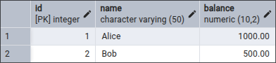
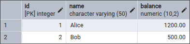
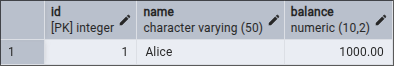
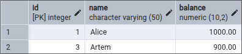
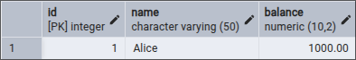
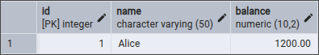

# ОТЧЕТ: ПРАКТИКА ПО АНОМАЛИЯМ ИЗОЛЯЦИИ В POSTGRESQL

В данном отчете представлены результаты тестирования параллельных транзакций в СУБД PostgreSQL. Были воспроизведены и проанализированы основные аномалии изоляции.

---

## 1. ПОДГОТОВКА СРЕДЫ

Для тестов использовалась таблица accounts (счета пользователей) и users (информация о пользователях).

**SQL-скрипт инициализации (init.sql):**

---

## 2. DIRTY READ (ГРЯЗНОЕ ЧТЕНИЕ)

**Суть:** Транзакция читает данные, которые были изменены другой транзакцией, но еще не зафиксированы (не сделан COMMIT). Если та транзакция сделает ROLLBACK (отмену), первая будет работать с данными, которых «никогда не существовало».

**Шаги воспроизведения:**
1. Сессия 1: Начинает транзакцию и снимает 100 у Alice (UPDATE).
2. Сессия 2: Пытается прочитать баланс Alice (SELECT).
3. Сессия 1: Делает откат (ROLLBACK).

**Результат:**
В PostgreSQL на стандартном уровне (Read Committed) Сессия 2 **не увидит** изменений до тех пор, пока Сессия 1 не сделает COMMIT. Таким образом, PostgreSQL по умолчанию защищен от этой аномалии.

**Как избежать:**
Использовать уровень изоляции READ COMMITTED или выше.

---

## 3. NON-REPEATABLE READ (НЕПОВТОРЯЮЩЕЕСЯ ЧТЕНИЕ)

**Суть:** Повторное чтение одних и тех же данных в рамках одной транзакции выдает разные результаты из-за того, что другая транзакция изменила их и зафиксировала.

**Шаги воспроизведения:**

| Шаг | Сессия 1 (Alice) | Сессия 2 (Bob) |
| :--- | :--- | :--- |
| 1 | BEGIN; | |
| 2 | SELECT balance FROM accounts WHERE id = 1; -- (Видит 1000.00) | |
| 3 | | BEGIN; UPDATE accounts SET balance = 1200 WHERE id = 1; COMMIT; |
| 4 | SELECT balance FROM accounts WHERE id = 1; -- (Видит 1200.00!) | |
| 5 | COMMIT; | |

**Результат:**
В рамках одной транзакции Alice получила разные значения баланса для одной и той же строки.

**Как избежать:**
Установить уровень изоляции REPEATABLE READ.

---

## 4. PHANTOM READ (ФАНТОМНОЕ ЧТЕНИЕ)

**Суть:** В рамках одной транзакции повторный запрос с фильтром (WHERE) возвращает разное количество строк из-за того, что другая транзакция добавила новые данные.

**Шаги воспроизведения:**

| Шаг | Сессия 1 (Alice) | Сессия 2 (Bob) |
| :--- | :--- | :--- |
| 1 | BEGIN; | |
| 2 | SELECT * FROM accounts WHERE balance > 800; -- (Видит только Alice) | |
| 3 | | BEGIN; INSERT INTO accounts (name, balance) VALUES ('Artem', 900); COMMIT; |
| 4 | SELECT * FROM accounts WHERE balance > 800; -- (Видит Alice и Artem!) | |
| 5 | COMMIT; | |

**Результат:**
Первая выборка показывает начальное состояние данных:

Вторая выборка Alice вернула «фантомную» запись Artem, которой не было в начале транзакции:  

**Как избежать:**
В PostgreSQL уровень REPEATABLE READ уже защищает от фантомов (особенность реализации), но по стандарту SQL требуется SERIALIZABLE.

---

## 5. LOST UPDATE (ПОТЕРЯННОЕ ОБНОВЛЕНИЕ)

**Суть:** Две транзакции одновременно читают данные и пытаются их обновить. Изменения одной из транзакций затираются изменениями другой.

**Начальное состояние данных:**  

**Шаги воспроизведения:**

| Шаг | Сессия 1 (Alice) | Сессия 2 (Bob) |
| :--- | :--- | :--- |
| 1 | BEGIN; | BEGIN; |
| 2 | SELECT balance FROM accounts WHERE id = 1; -- (Видит 1000) | SELECT balance FROM accounts WHERE id = 1; -- (Видит 1000) |
| 3 | UPDATE accounts SET balance = 1000 - 100 WHERE id = 1; | |
| 4 | | UPDATE accounts SET balance = 1000 + 200 WHERE id = 1; |
| 5 | COMMIT; | COMMIT; |

**Результат:**
Если СУБД позволяет такое выполнение (на низких уровнях), итоговый баланс станет 1200, а списание 100 (которое сделала Alice) будет потеряно.

**Как избежать:**
1. Использовать SELECT ... FOR UPDATE (блокировка строки).
2. Использовать атомарные запросы: UPDATE accounts SET balance = balance + 200 ...
3. Использовать уровень REPEATABLE READ (в Postgres он выдаст ошибку при попытке параллельного обновления одной строки).

---

## ИТОГИ ТЕСТИРОВАНИЯ

По умолчанию PostgreSQL работает на уровне Read Committed, что защищает от Dirty Read, но оставляет возможность для Non-repeatable Read и Phantom Read.

**Таблица защиты PostgreSQL:**
* **Dirty Read:** Защищено всегда.
* **Non-repeatable Read:** Требуется REPEATABLE READ.
* **Phantom Read:** Требуется REPEATABLE READ (или SERIALIZABLE).
* **Lost Update:** Требуется использование блокировок или REPEATABLE READ.

